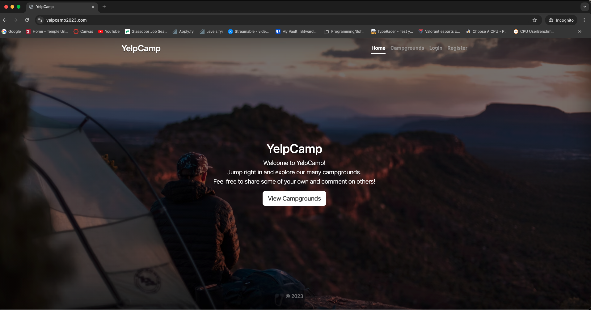
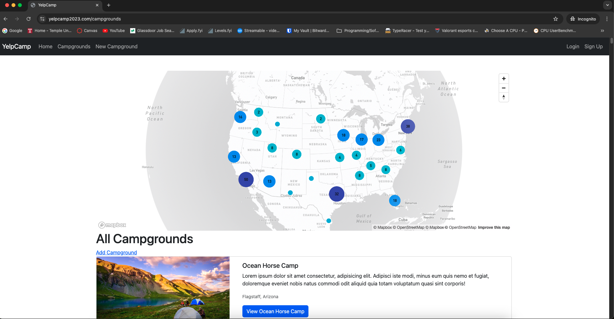
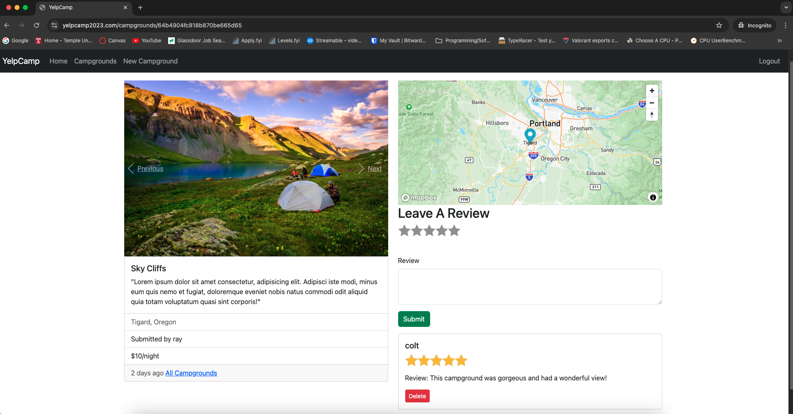

# YelpCamp

YelpCamp is a full-stack web application that allows users to create and review campgrounds. This project was developed as part of Colt Steele's Web Developer BootCamp course on Udemy. The application is built using MongoDB, Express.js, Node.js, Bootstrap, and Passport.js, and is deployed on Heroku.

## Link to Project
[YelpCamp2023.com](https://www.yelpcamp2023.com/)

## Features

- Campground Creation and Management:
    - Users can create new campgrounds with details such as location, description, and images.
    - Users can edit or delete their own campgrounds.
- User Authentication:
    - Users must sign up or log in to create campgrounds or leave reviews.
    - Authentication is handled using Passport.js.
- Campground Reviews:
    - Logged-in users can leave reviews on campgrounds.
    - Users can edit or delete their own reviews.
- Interactive Map:
    - The home page features an interactive map implemented with the Mapbox API.
    - Custom markers display the number of campgrounds in specific areas.
    - Users can click on cluster markers to zoom in and explore campgrounds in that area.

## Technologies Used

- MongoDB: Database for storing campground and user data.
- Express.js: Web framework for Node.js, used to build the backend.
- Node.js: JavaScript runtime for server-side programming.
- Bootstrap: Frontend framework for styling and responsive design.
- Passport.js: Middleware for user authentication.
- Mapbox API: Used to implement the interactive map on the home page.
- Heroku: Platform for deploying the application.

### Home Page

### Interactive Map/ Campgrounds

### Campground Page

